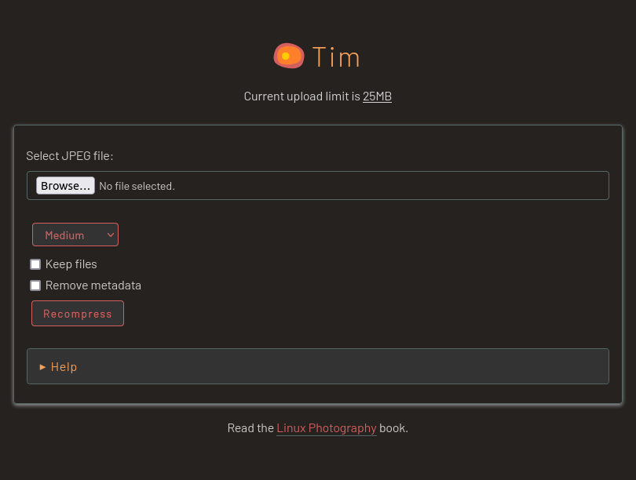

# Tim

Tim is a simple PHP-based web application for recompressing JPEG files.

## Dependencies

- Physical or virtual x86_64 Linux server
- PHP
- Git (optional)

## Installation and usage

1. Install the required packages on a local machine or a remote Linux server.
2. Clone the project's repository using the `git clone https://github.com/dmpop/tim.git` command. Alternatively, download the latest source code using the appropriate button on the project's pages.
3. Open the _config.php_ file and configure the desired options.

To run Tim, switch in the terminal to the _tim_ directory and execute the `php -S 0.0.0.0:8000` command.

To access Tim, point the browser to _http://127.0.0.1:8000_ (replace _127.0.0.1_ with the actual IP address or domain name of the machine running Tim).

To host Tim on a remote web server, move the the _tim_ directory to the document root of the server. Make the _tim_ directory writable by the server using the `sudo chown www-data:www-data -R tim/` command.

To change the default upload size, open the _php.ini_ file for editing (for example, `sudo nano /etc/php7/cli/php.ini`) and adjust the values of the `upload_max_filesize`, `post_max_size`, and `memory_limit` parameters.

The [Linux Photography](https://gumroad.com/l/linux-photography) book provides detailed information on deploying and using Tim. Get your copy at [Google Play Store](https://play.google.com/store/books/details/Dmitri_Popov_Linux_Photography?id=cO70CwAAQBAJ) or [Gumroad](https://gumroad.com/l/linux-photography).

## Problems?

Please report bugs and issues in the [Issues](https://github.com/dmpop/tim/issues) section.

## Contribute

If you've found a bug or have a suggestion for improvement, open an issue in the [Issues](https://github.com/dmpop/tim/issues) section.

To add a new feature or fix issues yourself, follow the following steps.

1. Fork the project's repository.
2. Create a feature branch using the `git checkout -b new-feature` command.
3. Add your new feature or fix bugs and run the `git commit -am 'Add a new feature'` command to commit changes.
4. Push changes using the `git push origin new-feature` command.
5. Submit a pull request.

## Author

Dmitri Popov [dmpop@linux.com](mailto:dmpop@linux.com)

## License

The [GNU General Public License version 3](http://www.gnu.org/licenses/gpl-3.0.en.html)
 
